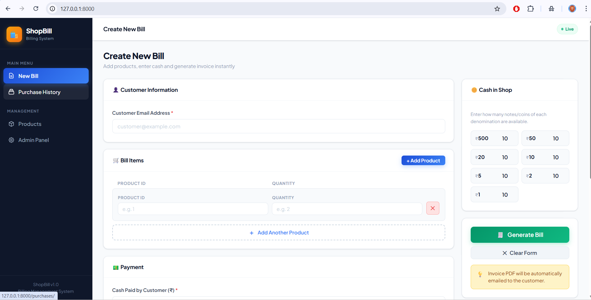
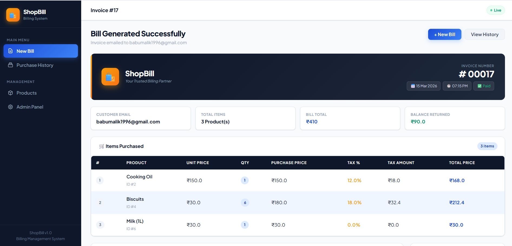
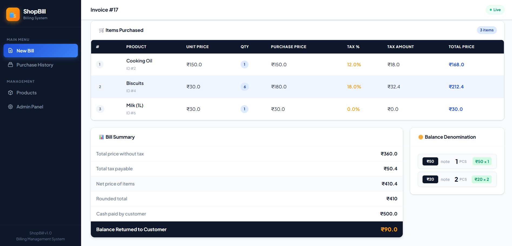
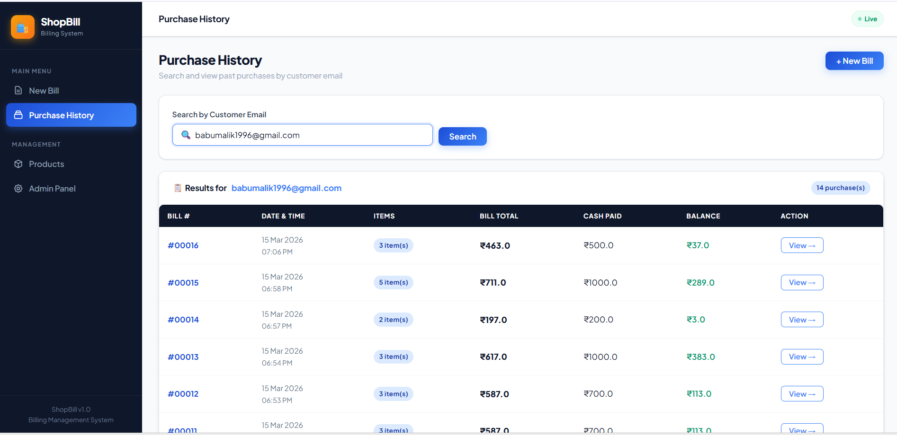
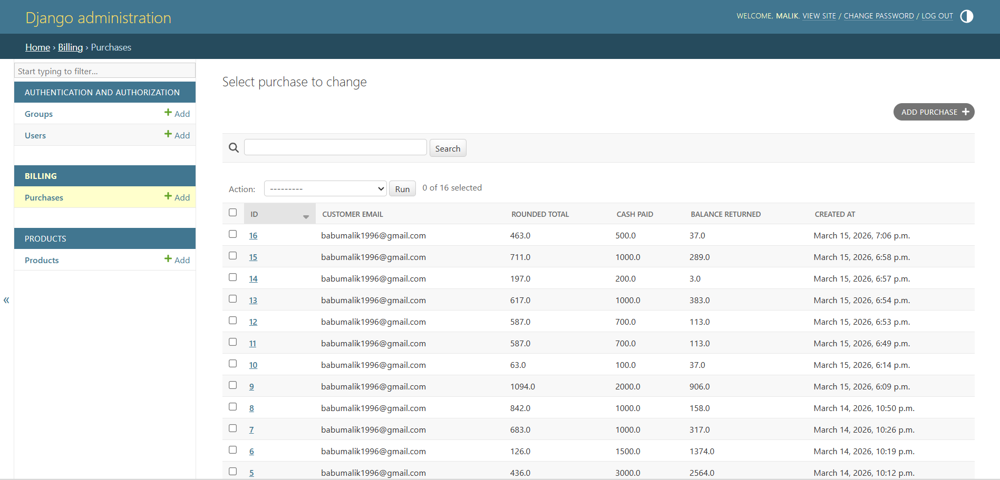
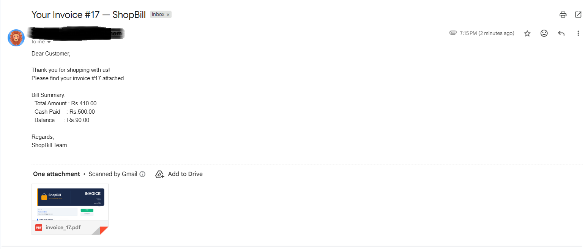

# 🛍️ ShopBill — Billing Management System

> A professional Django-based billing system for retail shops.
> Generates invoices, calculates change denominations automatically,
> and emails PDF invoices to customers in real time.

---

## 📸 Screenshots

### 🧾 Create New Bill


### 📊 Bill Result & Summary


### 🪙 Balance Denomination


### 📋 Purchase History


### 🔍 Purchase Detail


### 📧 Invoice Email


---

## ✨ Features

- ✅ Generate bills with multiple products dynamically
- ✅ Auto tax calculation per product
- ✅ Smart balance denomination breakdown (greedy algorithm)
- ✅ PDF invoice automatically emailed to customer
- ✅ Purchase history search by customer email
- ✅ View complete item details of any past bill
- ✅ Django Admin for product and purchase management
- ✅ Async email sending via Celery + Redis
- ✅ Professional UI with separated CSS static files
- ✅ 29 automated tests — all passing

---

## 🛠️ Tech Stack

| Layer          | Technology          |
|----------------|---------------------|
| Framework      | Django 5.x          |
| Database       | MySQL               |
| Async Tasks    | Celery + Redis      |
| PDF Invoice    | ReportLab           |
| Email          | Gmail SMTP          |
| Testing        | Django TestCase     |
| Frontend       | HTML + CSS          |

---

## 📁 Project Structure
```
shopbill/
├── shopbill/               ← Django project config
│   ├── settings.py
│   ├── urls.py
│   ├── celery.py
│   └── __init__.py
├── products/               ← Product catalog
│   ├── models.py
│   └── admin.py
├── billing/                ← Core billing logic
│   ├── models.py
│   ├── views.py
│   ├── forms.py
│   ├── services.py         ← All business logic
│   ├── tasks.py            ← Async email task
│   ├── invoice_pdf.py      ← PDF generator
│   └── tests.py            ← 29 automated tests
├── purchases/              ← Purchase history
│   ├── views.py
│   └── urls.py
├── templates/              ← HTML templates
│   ├── base.html
│   ├── billing/
│   │   ├── bill_form.html
│   │   └── bill_result.html
│   └── purchases/
│       ├── search.html
│       └── detail.html
├── static/
│   └── css/
│       ├── base.css
│       ├── bill_form.css
│       ├── bill_result.css
│       └── purchases.css
├── .env.example            ← Environment variable template
├── requirements.txt        ← All dependencies
└── README.md
```

## 🌐 Access the App

| Page             | URL                              |
|------------------|----------------------------------|
| Home / New Bill  | http://127.0.0.1:8000            |
| Purchase History | http://127.0.0.1:8000/purchases  |
| Admin Panel      | http://127.0.0.1:8000/admin      |

---

## 🌱 Seed Products

Go to **Admin Panel → Products → Add Product** and add your products.

Sample products to get started:

| ID | Name              | Price  | Stock | Tax % |
|----|-------------------|--------|-------|-------|
| 1  | Rice (1kg)        | 60.00  | 100   | 5     |
| 2  | Cooking Oil (1L)  | 150.00 | 60    | 12    |
| 3  | Sugar (1kg)       | 50.00  | 80    | 5     |
| 4  | Biscuits (Pack)   | 30.00  | 200   | 18    |
| 5  | Wheat Flour (1kg) | 45.00  | 100   | 5     |
| 6  | Milk (1L)         | 30.00  | 150   | 0     |
| 7  | Tea Powder (250g) | 80.00  | 75    | 5     |
| 8  | Detergent (500g)  | 95.00  | 90    | 18    |

---
## 👨‍💻 Developer

<div align="center">

  <h3>Malik Babu</h3>
  <p>Python Backend Developer</p>

  [](https://pybabu.github.io/malik/)
  [](https://github.com/PyBabu)

  <br>

  > *"Built with passion, precision and Python."*

</div>

---

<div align="center">
  Built with ❤️ using Django + Python &nbsp;|&nbsp; Developed by <strong><a href="https://pybabu.github.io/malik/">Malik Babu</a></strong>
</div>
